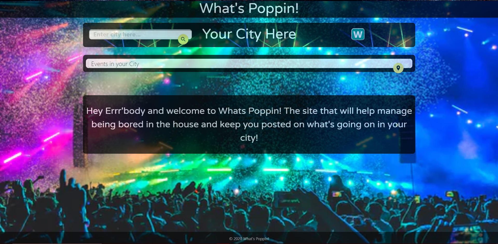
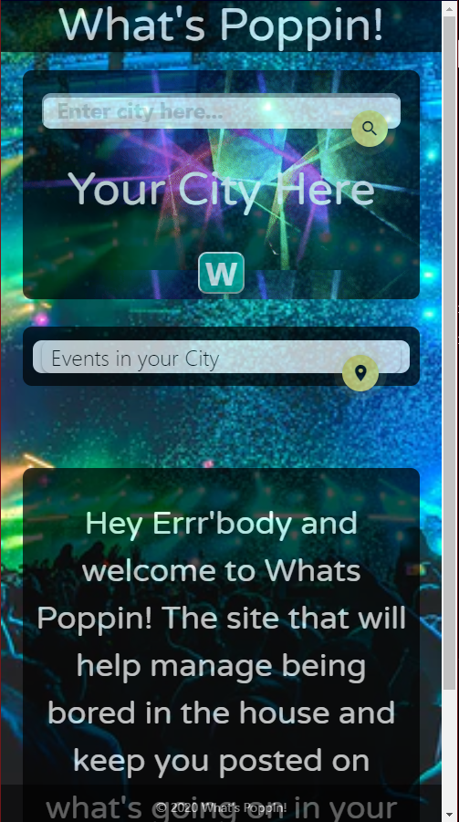
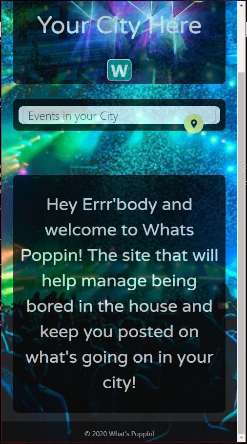

# Project-1

## Title: PoppIn!

Project:
With the current state of the Corona virus, we are trying to figure out what there is to do in your area and to find out what is PoppIn in your area and the weather.

User Story:
We are looking to see what is PoppIn in our area based on events. A user will type in a desired location, and then they will be presented with various events their location on a map and the current weather. Check out our screenshot for more info.

After being stuck inside
I WANT to know what is PoppIn?
I WILL TYPE in a city and hit SUBMIT
When I hit SUBMIT
The computer will RENDER a list of EVENTS, a MAP, and the WEATHER
So I can find out what is PoppIn in any city.

Details:
For this project, Danny, Marcus, Logan and Kate will work collaborativilty to create an online app to help users find local events. We have broken up into two teams, a front end consisting of Marcus and Danny and the back end team, Logan and Kate.

Our application will be created for mobile devices and desktop friendly, with three API functions, one for pulling events, a map API, and weather API.

 
 
 

 
 
 
 

 
 
 
 

# Contributors
 
Kate, Danny, Logan, Marcus!
